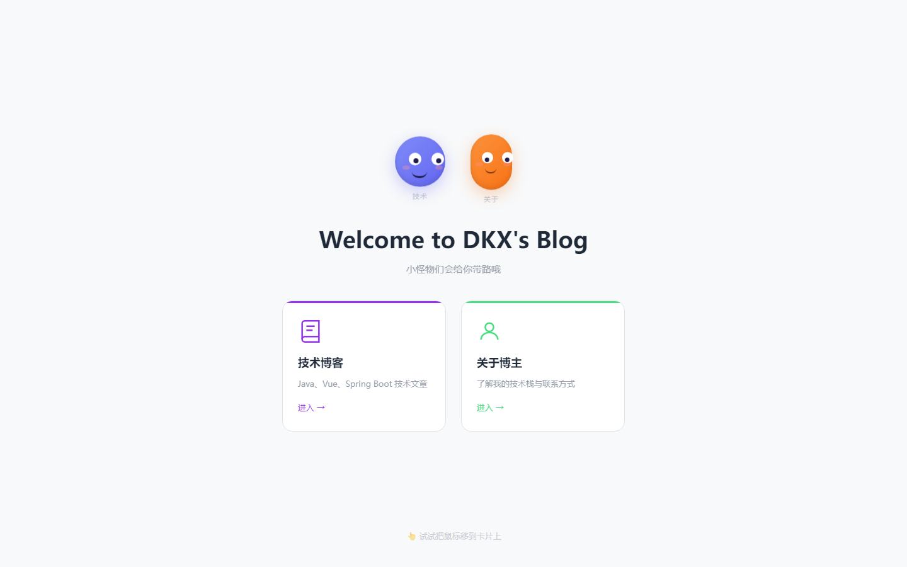
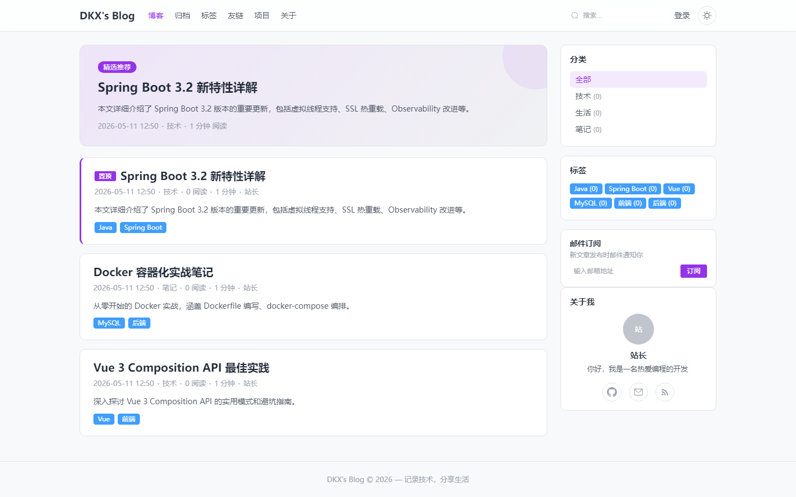
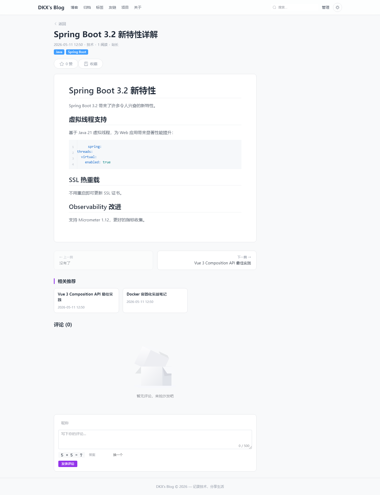
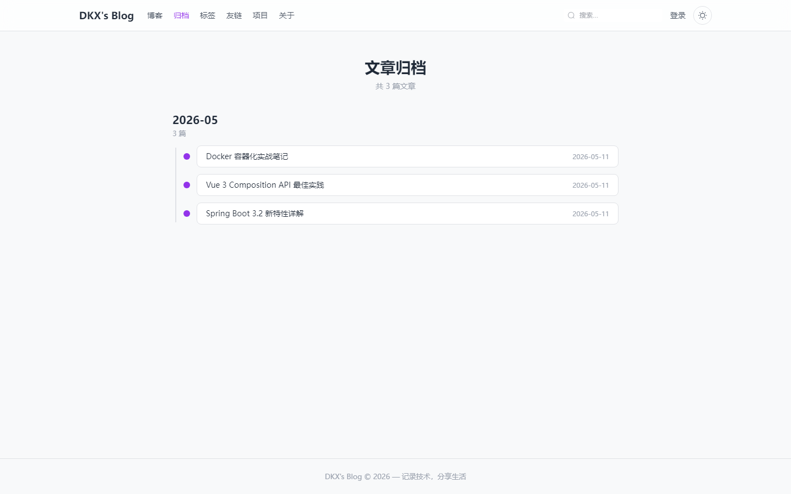
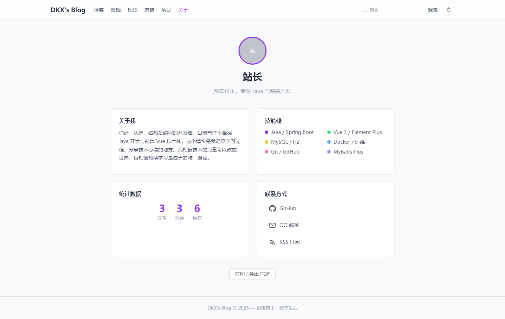
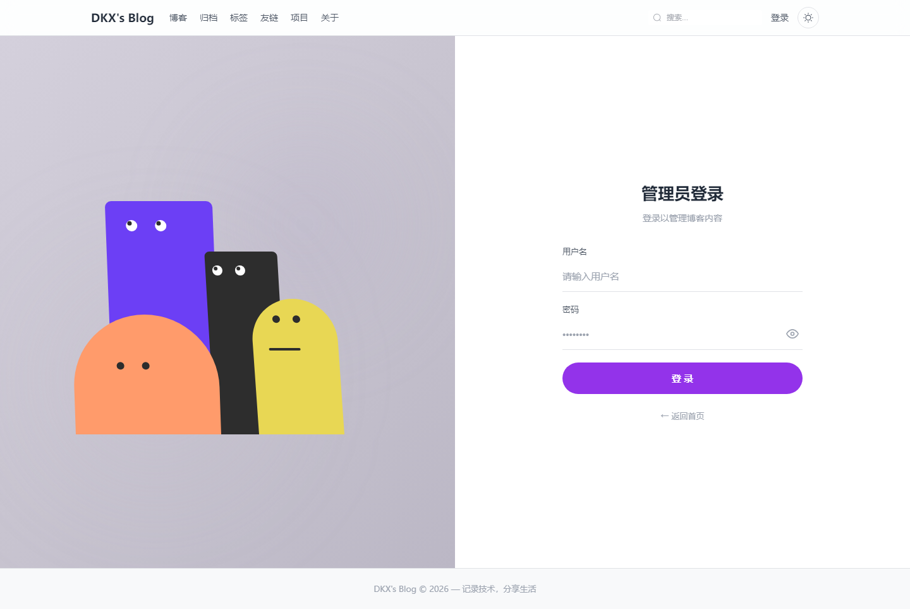
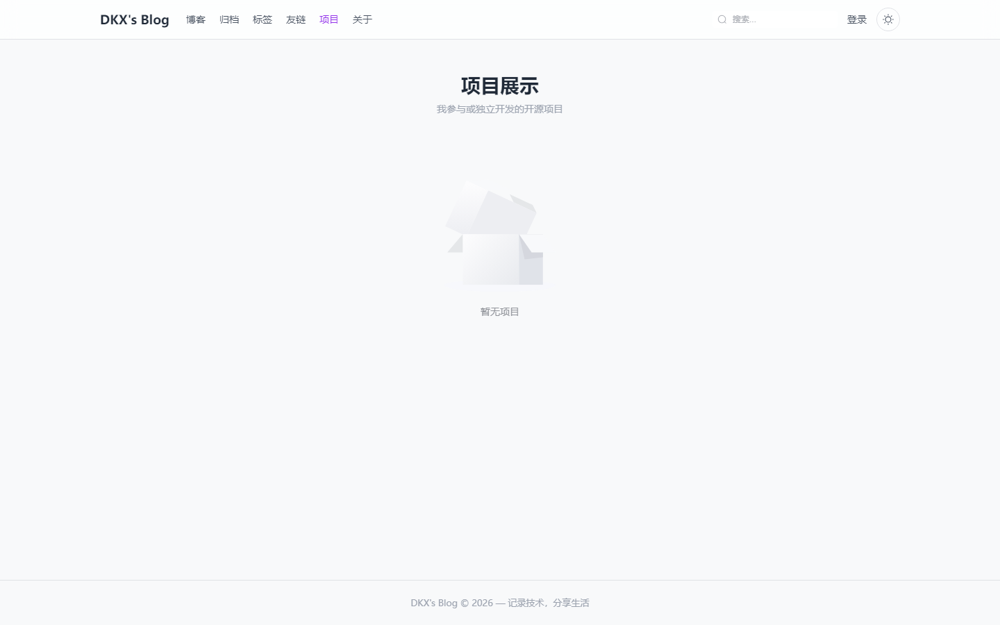
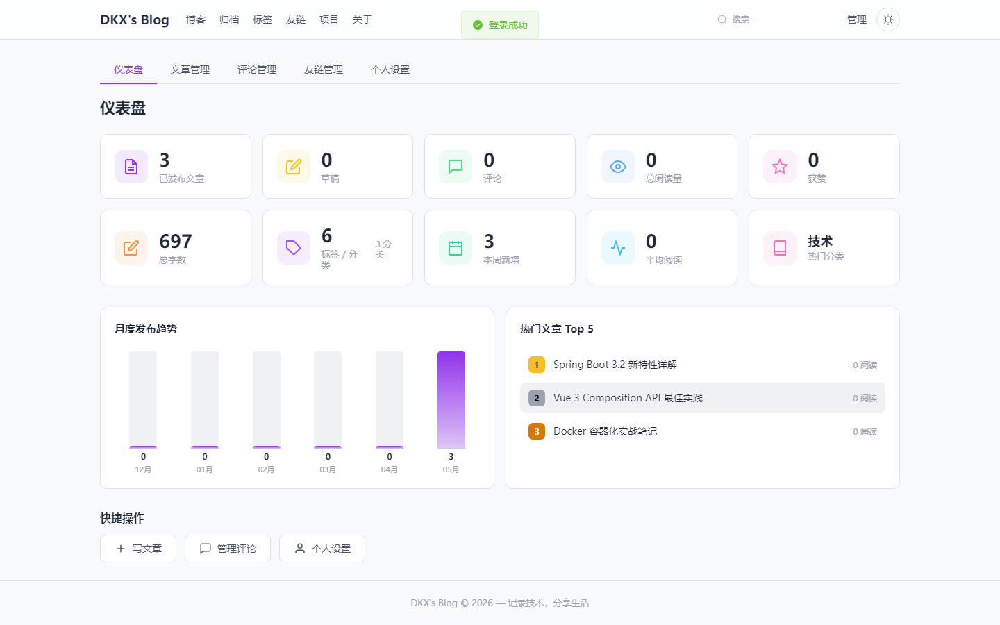
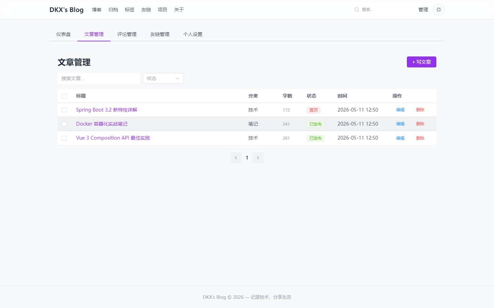

# DKX's Blog

个人博客系统，前后端分离，深色主题，Markdown 写作。

## 技术栈

| 层 | 技术 |
|---|------|
| 后端 | Spring Boot 3.2.5 + MyBatis Plus 3.5.6 + JWT (jjwt 0.12.5) + jBCrypt |
| 前端 | Vue 3 (Composition API) + Element Plus + Pinia + Vue Router + Vite |
| 编辑器 | @kangc/v-md-editor + highlight.js |
| 数据库 | H2 (开发) / MySQL 8.0 (生产) |
| 部署 | Docker + Docker Compose + Nginx |

## 功能

- **公开页面**：门户欢迎页（眼睛跟踪）、文章列表、文章详情、搜索、归档时间轴、标签云、友链、项目展示、关于/简历
- **Markdown 编辑**：v-md-editor，支持粘贴图片上传、代码高亮、行号、Emoji
- **评论系统**：嵌套回复、数学验证码、邮件通知
- **文章系列**：系列导航、置顶、定时发布
- **RSS 订阅**：`/api/rss`，邮件订阅新文章通知
- **后台管理**：仪表盘（统计+趋势图）、文章 CRUD、评论审核、友链管理、个人设置
- **主题**：深色/浅色切换，打印/导出 PDF 自动切浅色
- **SEO**：Sitemap、Open Graph、Twitter Card
- **移动端**：汉堡菜单、响应式布局

## 界面预览

### 前台

| 门户页 | 文章列表 |
|--------|---------|
|  |  |

| 文章详情 | 归档时间轴 |
|----------|-----------|
|  |  |

| 关于/简历 | 登录页 | 项目展示 |
|-----------|--------|----------|
|  |  |  |

### 后台

| 仪表盘 | 文章管理 |
|--------|---------|
|  |  |

## 快速开始

### 环境要求

- JDK 17+
- Node.js 18+
- Maven 3.8+（或直接用 `mvnw`）

### 启动后端（H2 内存数据库，免安装）

```bash
cd blog-server
./mvnw spring-boot:run -Dspring-boot.run.profiles=h2
```

后端运行在 `http://localhost:8080`，H2 控制台在 `http://localhost:8080/h2-console`。

### 启动前端

```bash
cd blog-web
npm install
npm run dev
```

前端运行在 `http://localhost:5173`，自动代理 `/api` 到后端。

### 登录

打开 `http://localhost:5173/login`，用户名 `admin`，密码 `admin123`。

## 项目结构

```
blog/
├── blog-server/                  # Spring Boot 后端
│   └── src/main/java/com/blog/
│       ├── controller/           # Auth, Article, Admin, Common, Upload, Rss, Sitemap, Captcha
│       ├── service/              # Service + Impl (含定时发布、邮件通知)
│       ├── entity/               # User, Article, Comment, Category, Tag, FriendLink, Subscriber
│       ├── dto/                  # ArticleVO, CommentVO, CategoryVO, TagVO, PageVO
│       ├── mapper/               # MyBatis Plus Mapper
│       ├── config/               # WebConfig (CORS+JWT), MybatisPlusConfig
│       ├── interceptor/          # JwtInterceptor
│       └── common/               # Result, JwtUtils, GlobalExceptionHandler
├── blog-web/                     # Vue 3 前端
│   └── src/
│       ├── views/                # 11 公开页 + 6 后台页
│       ├── components/           # 6 组件 (TOC, Lightbox, ThemeToggle, 等)
│       ├── composables/          # 4 composable (Bookmark, History, SEO, Theme)
│       ├── directives/           # 3 指令 (CodeCopy, FadeIn, LazyImage)
│       ├── api/                  # Axios 封装 + API 模块
│       ├── router/               # Vue Router (16 条路由)
│       └── store/                # Pinia 用户状态
├── docker-compose.yml            # 一键部署
├── nginx.conf                    # Nginx 反向代理
└── schema.sql                    # MySQL 建表脚本
```

## Docker 一键部署

```bash
# 1. 克隆项目
git clone https://github.com/DKXaiLBY/blog.git
cd blog

# 2. (可选) 配置环境变量
cp .env.example .env
# 编辑 .env 修改密码和密钥

# 3. 一键启动
docker compose up -d
```

首次启动会自动：构建后端 JAR → 构建前端 → 初始化数据库 → 启动服务。服务运行在 `http://your-server-ip`。

> 需要安装 Docker 和 Docker Compose。更多部署方式（宝塔面板、手动部署、阿里云、Vercel 等）见 **[DEPLOY.md](DEPLOY.md)**

## 本地开发

### 启动后端（H2 内存数据库，免安装）

## API 概览

### 公开接口

| 方法 | 路径 | 说明 |
|------|------|------|
| GET | `/api/articles` | 文章列表 `?page=&size=&categoryId=` |
| GET | `/api/articles/search` | 搜索文章 `?keyword=` |
| GET | `/api/articles/{id}` | 文章详情 |
| GET | `/api/articles/{id}/related` | 相关文章 `?limit=3` |
| GET | `/api/articles/{id}/comments` | 文章评论（含嵌套回复） |
| GET | `/api/articles/archives` | 归档时间轴 |
| POST | `/api/comments` | 发表评论 |
| GET | `/api/captcha` | 获取数学验证码 |
| GET | `/api/categories` | 分类列表（含文章计数） |
| GET | `/api/tags` | 标签列表（含文章计数） |
| GET | `/api/user/profile` | 博主信息（昵称/头像/简介/技能/项目） |
| GET | `/api/featured` | 精选/最新文章 |
| GET | `/api/friends` | 友链列表 |
| POST | `/api/friends/apply` | 申请友链 |
| POST | `/api/subscribe` | 邮件订阅 |
| GET | `/api/subscribe/verify` | 确认订阅 `?token=` |
| POST | `/api/unsubscribe` | 退订 |
| GET | `/api/rss` | RSS 订阅源 |
| GET | `/api/sitemap.xml` | SEO 网站地图 |

### 后台接口（需 JWT，Header: `Authorization: Bearer <token>`）

| 方法 | 路径 | 说明 |
|------|------|------|
| POST | `/api/auth/login` | 登录，返回 token |
| GET | `/api/admin/dashboard` | 仪表盘统计数据 |
| GET | `/api/admin/articles` | 文章列表（含草稿）`?page=&size=&keyword=&status=` |
| GET | `/api/admin/articles/{id}` | 文章详情（含草稿） |
| POST | `/api/admin/articles` | 创建文章 |
| PUT | `/api/admin/articles/{id}` | 更新文章 |
| DELETE | `/api/admin/articles/{id}` | 删除文章 |
| POST | `/api/admin/articles/batch-delete` | 批量删除 |
| POST | `/api/admin/articles/batch-status` | 批量更新状态 |
| GET | `/api/admin/comments` | 评论列表 `?page=&size=&articleId=&status=` |
| PUT | `/api/admin/comments/{id}/status` | 审核评论 `?status=1/2` |
| DELETE | `/api/admin/comments/{id}` | 删除评论 |
| GET | `/api/admin/friends` | 友链列表（含待审核） |
| POST | `/api/admin/friends` | 添加友链 |
| PUT | `/api/admin/friends/{id}` | 编辑友链 |
| DELETE | `/api/admin/friends/{id}` | 删除友链 |
| PUT | `/api/admin/friends/{id}/status` | 审核友链 `?status=1/2` |
| GET | `/api/admin/subscribers` | 订阅者列表 |
| DELETE | `/api/admin/subscribers/{id}` | 删除订阅者 |
| POST | `/api/admin/upload` | 上传封面图片 |
| PUT | `/api/admin/user/profile` | 更新个人设置 |
| PUT | `/api/admin/user/password` | 修改密码 |
| PUT | `/api/admin/user/avatar` | 更新头像 |

## License

MIT
